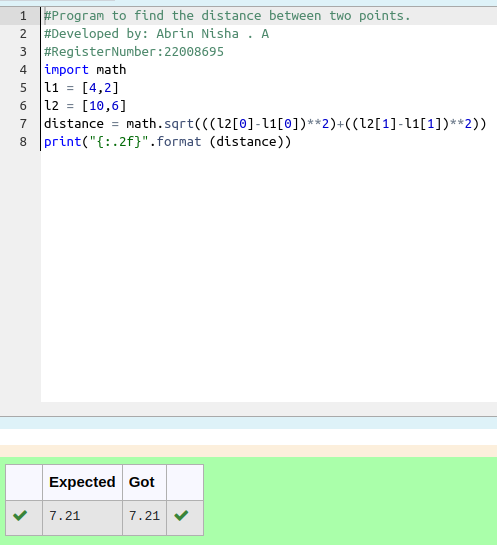

# DISTANCE-BETWEEN-TWO-POINTS

## AIM:

To write a python program to find the distance two 2 points

## ALGORITHM:

### Step 1: 
Get the two values from the user
### Step 2:
Assign the value of second variable to a temporary variable
### Step 3: 
Substitute the values in the distance formula  
### Step 4: 
Assign the value in temporary variable to the first variable
### Step 5: 
End the program

### PROGRAM:
```python
#Program to find the distance between two points.
#Developed by: Abrin Nisha . A
#RegisterNumber:22008695
import math
l1 = [4,2]
l2 = [10,6]
distance = math.sqrt(((l2[0]-l1[0])**2)+((l2[1]-l1[1])**2))
print("{:.2f}".format (distance))
```

### OUTPUT:


### RESULT:
Thus the distance between two points are successfully solved using python programming